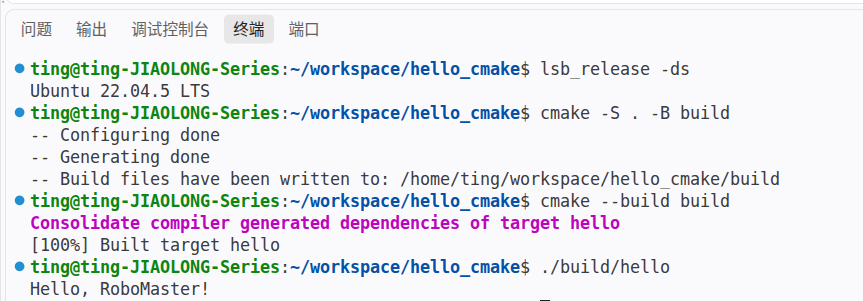

# hello_cmake

## 项目简介

这是 RoboMaster 算法组新生培训的 Hello CMake 项目。

该项目使用 C++ 编写，通过 CMake 完成构建，并使用 Git 进行版本管理。

## 环境

- Ubuntu 22.04 LTS
- CMake 3.22+
- GCC 11+
sudo apt update
sudo apt install -y build-essential cmake git

## 目录结构
```test
hello_cmake/
├── CMakeLists.txt
├── README.md
├── .gitignore
├── images/
│ └── success.png
└── src/
  └── main.cpp
src/     保存源代码
images/  保存 README 使用的截图
build/   保存 CMake 生成的构建文件和程序
```

## 构建步骤

```bash
cd hello_cmake
cmake -S . -B build
cmake --build build
```

## 运行结果

运行：
```bash
./build/hello
```

输出：
```test
Hello, RoboMaster!
```


## 作者与日期
```test
姓名：张绮婷
学号：2264423010
完成日期：9月20日
```